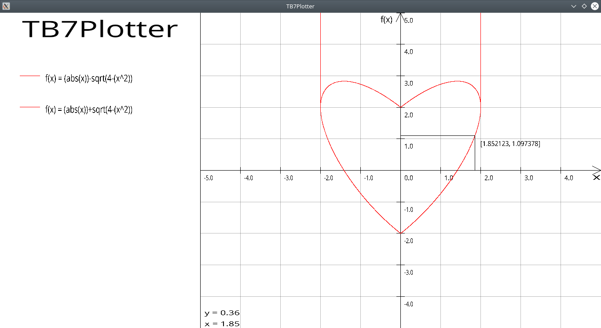

# TB7 Plotter

A program to visualize the plotter of mathematical functions passed in by the user. It consists in four parts : *Lexical Analyser* , *Syntaxical Analyser*, *Code Interpreter* and *Grapher*.

## Getting Started

Open the project in your favorite IDE equipped with the SDL libraries and simply run it as it is.

### Prerequisites

The SDL2, SDL2-Image and SDL2-ttf libraries are needed to compile the program.

### Building

In order to build the program, you need the SDL libraries, please see [SDLwiki](https://wiki.libsdl.org/Installation).
The executable **must** be in the same folder as the fonts folder

### Usage

Follow the instructions in the console.

## Built With

* [SDL](https://www.libsdl.org/)

## Authors

* **Mathis Cariou** - GUI / team leader
* **Marianne De Poorter** - GUI
* **Jérémy Albrecht** - Syntax
* **Bastien Delforge** - Syntax
* **Louise Saliba** - Evaluator
* **Flavie Amyot** - Evaluator
* **Salim El Fadali** - Lexical
* **Benoît Piette** - Lexical

## License

This project is licensed under the GNU v3 License - see the [LICENSE](LICENSE) file for details

